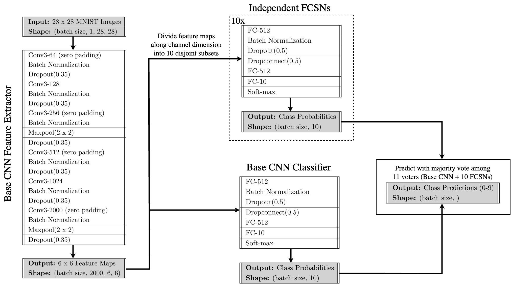

# A PyTorch Implementation of EnsNet
This project uses the PyTorch framework to implement the EnsNet model for classifying handwritten digits (0–9) from the MNIST dataset, as described in the paper [Ensemble Learning in CNN Augmented with Fully Connected Subnetworks (2023)](https://www.jstage.jst.go.jp/article/transinf/E106.D/7/E106.D_2022EDL8098/_pdf/-char/en).

## Project Overview

The primary objective of an EnsNet model is to improve the classification accuracy of a base _convolutional neural network (CNN)_ by training a diverse set of independent, fully-connected subnetworks (FCSNs) and aggregating their outputs using an ensemble learning approach. The figure above illustrates the architecture based on Tables 1 and 2 from the original paper by [Hirata & Takahashi (2023)](#references). The architecture implemented in this project closely follows this design, with a few modifications — most notably, the addition of padding in certain convolutional layers to address ambiguities present in the paper. Overall, the model consists of a base CNN and an ensemble of 10 FCSNs. One of the main roles of the base CNN is to act as a feature extractor, transforming an input image into various representations in the form of feature maps. These feature maps are first passed through the base CNN's classifier, producing a set of class probabilities. This step is much like any standard CNN; however, what sets EnsNet apart is that the feature maps are also partitioned into 10 disjoint subsets, each assigned to one of the FCSNs. Each FCSN then acts as an additional independent classifier, using its respective subset to compute its own set of class probabilities. The class predictions from the base CNN and the 10 FCSNs are then combined using _majority voting_, where the most commonly predicted class determines the final predicted class for the input image. 

The training loop for the EnsNet model alternates between a base CNN training step and a FCSN training step. The base CNN training step only updates the base CNN based on its own performance on the training dataset; all FCSNs are frozen. The enables the base CNN to learn rich feature representations from the input images and fine-tune its classifier for accurate prediction. Conversely, the FCSN training step only updates the FCSNs, while the base CNN is frozen and only serves as a feature extractor. During this phase, each FCSN is **independently** trained on its respective subset of the feature maps produced by the CNN, ensuring that it only adapts its classifier to the portion of the representation space it receives during inference.

The training step for the base CNN and each FCSN use the same _cross entropy_ loss function and optimization algorithm (_Adam_). Lastly, the MNIST training data is augmented using random affine transformations, as specified in [Hirata & Takahashi (2023)](#references):
```
transforms.RandomAffine(degrees = 10, # Rotate up to -/+ 10 degrees
                        scale = (0.8, 1.2), # Scale between 80 and 120 percent
                        translate = (0.08, 0.08), # Translate up to -/+ 8 percent in both x and y
                        shear = 0.3),  # Shear up to -/+ 0.3 degrees
```

## Recommended Installations Instructions
#### 1) Create a New Python Environment
This environment should use **Python >= 3.10**.

#### 2) Clone the ```ensnet-pytorch``` Repo
In the command line, clone the repository using:
```
git clone https://github.com/Jechen00/ensnet-pytorch.git
```

#### 3) Install Packages
Navigate into the ensnet-pytorch directory with ```cd ensnet-pytorch``` and run one of the following:
```
# For pip:
pip install -r requirements.txt

# For conda/mamba:
conda install -y -c conda-forge --file requirements.txt
```
Alternatively, the packages can be installed manually like so:
```
pip install numpy==2.2.4
pip install torch==2.6.0
pip install torchvision==0.21.0
```

## Training Instructions
The model can be trained by executing the run_training.py script from the command line. This script accepts the following arguments:
```
-nw, --num_workers       Number of workers for dataloaders. (default: 0)
-ne, --num_epochs        Number of epochs to train the model for. (default: 15)
-bs, --batch_size        Size of batches for training and testing sets. (default: 100)
-lr, --learning_rate     Learning rate for the optimizers. (default: 0.001)
-p, --patience           Number of epochs to wait without improvement before early stopping. (default: 5)
-md, --min_delta         Minimum change in performance metric to reset early stopping counter. (default: 0.001)
-sd, --save_dir          Directory to save the model. Required if `mod_name` is provided or `save_results` is True. (default: None)
-mn, --mod_name          Filename for the saved model. Defaults to 'ensnet_model.pth' if given save_dir. (default: None)
-sr, --save_results		 If included, saves the returned results as .pkl files in `save_dir.`
```
### Example usage
If we are typing all arguments out, running the program may look like this:
```
python run_training.py -nw 0 -ne 15 -bs 100 -lr 0.001 -p 5 -md 0.001 -sd './saved_models' -mn 'ensnet_model.pth' -sr
```

Alternatively, we can edit the arguments in the `args.txt` file and run the program like this:
```
python run_training.py @args.txt
```

## References
Hirata, D., & Takahashi, N. 2023, IEICE Transactions on Information and Systems, E106.D, 1258, [doi: 10.1587/transinf.2022EDL8098](https://www.jstage.jst.go.jp/article/transinf/E106.D/7/E106.D_2022EDL8098/_article)
